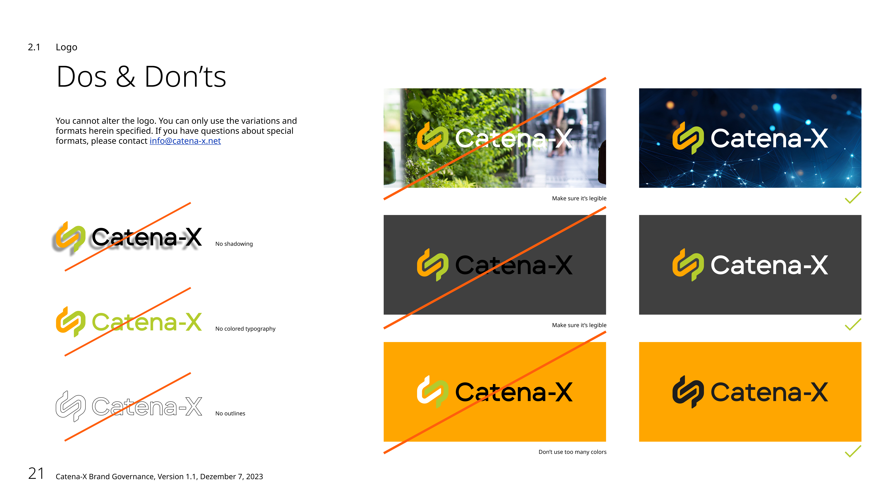

# Catena-X Resources

This repository offers various Catena-X contents to download.

## Use of Catena-X Labels

To use the labels, you **must**:

1. Downloaded the contract [HERE](./static/Logo%20Use%20Agreement_V2_BOtOG.pdf)
2. Countersign the contract
3. Sent signed contract to [info@catena-x.net](mailto:info@catena-x.net)
4. Download the labels [HERE](https://github.com/catenax-eV/cx-resources)

The labels can then be used under the conditions stated in the [contract](https://github.com/catenax-eV/cx-resources), the [Operating Model](https://catenax-ev.github.io/docs/next/operating-model/how-data-space-governance#catena-x-labels) and the [Catena-X Brand Governance](./static/Catena-X_Brand_Governance.pdf).

Further details and a description of the Catena-X Labels can be found in the [Operating Model](https://catenax-ev.github.io/docs/next/operating-model/how-data-space-governance#catena-x-labels).

Excerpt from the [Catena-X Brand Governance](./static/Catena-X_Brand_Governance.pdf):

  
*Catena-X Brand Governance Logo Dos & Don'ts*
